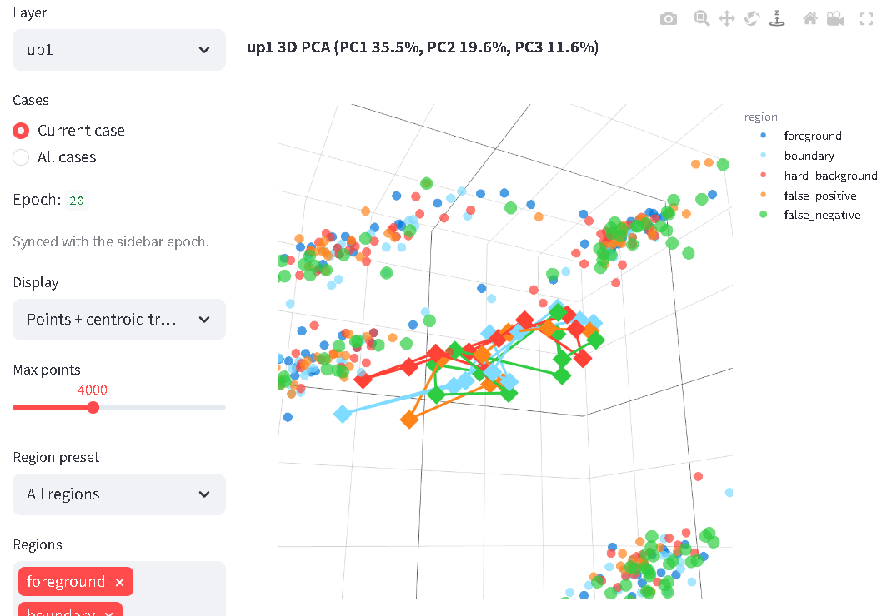

# SegEvo

[](https://github.com/DZW131/SegEvo/actions/workflows/ci.yml)

**Language:** English | [简体中文](README.zh-CN.md)

SegEvo is a lightweight, model-agnostic observability tool for medical image
segmentation training. It records a small set of fixed probe cases across epochs and
turns them into an interactive dashboard for understanding how a model learns, where
it fails, and whether its internal feature representation is becoming more stable.

SegEvo is not a new training framework. It is an observation layer that can be added
to ordinary PyTorch segmentation projects with a few logging calls. It can be used
with U-Net, nnU-Net-style code, UNETR/SwinUNETR, DeepLab-like models, MedNeXt-style
models, WSI tile segmentation models, or custom CNN/Transformer segmentation models,
as long as your training loop can provide image, ground truth, prediction, and
optionally intermediate features.

## Demo Video

https://github.com/user-attachments/assets/869d7d83-a646-448b-b71c-8e0e5c1dde7c

The demo walks through the SegEvo dashboard, including case-level training evolution,
3D feature-space analysis, and boundary-learning diagnostics.

## Dashboard Preview



The 3D Feature Space view supports PCA, UMAP, and t-SNE projections to show how
foreground, boundary, hard background, false positive, and false negative feature
samples move and separate across epochs. PCA is more stable; UMAP/t-SNE are better
for exploring local cluster structure.

## Why SegEvo

Final Dice or HD95 tells you what happened at the end of training. It often does not
tell you how the model got there.

SegEvo helps answer questions such as:

- Did a probe case improve smoothly, or did it repeatedly regress during training?
- Are the remaining errors mostly false positives, false negatives, or boundary shifts?
- Did boundary quality really improve, or did Dice hide edge errors?
- Are foreground, boundary, hard background, FP, and FN features separating over time?
- Which logged layer gives the clearest diagnostic signal?
- Is a model learning a stable representation, or only fitting easy regions?

This is especially useful for medical segmentation research, where small objects,
uncertain boundaries, hard negative tissue, scanner/domain shifts, and sparse validation
cases can make final aggregate metrics misleading.

## What You Get

Run the bundled demo and open the dashboard:

```bash
segevo-demo --out runs/demo
segevo-dashboard --run runs/demo --host 0.0.0.0 --port 7860
```

The dashboard has three main pages:

| Page | What it shows | What you can learn |
| --- | --- | --- |
| `Case Timeline` | Image + GT, image + prediction, FP/FN error map, metric timeline, and current-epoch training readout. | Whether a fixed probe case is improving, whether errors are mostly FP or FN, and whether visual quality matches metric improvement. |
| `Feature Space` | Stable 3D PCA plus exploratory UMAP/t-SNE projections of sampled layer features, region presets, FP/FN focus mode, centroid trajectories, epoch playback, optional convex hull or density surfaces, point inspection, and HTML export. | Whether the model's internal representation is organizing foreground, boundary, hard background, FP, and FN into meaningful groups. PCA is more stable; UMAP/t-SNE are better for exploring local cluster structure. |
| `Boundary Learning` | Boundary Dice, surface Dice, HD95, boundary feature separation, and a boundary training readout. | Whether the model is learning usable boundaries instead of only coarse mask overlap. |

Each page includes an expanded bilingual usage guide in the app explaining the controls,
how to read the plots, and what training signals can be inferred from them.

## Installation

SegEvo requires Python 3.10 or newer.

### Option A: virtualenv

```bash
git clone https://github.com/DZW131/SegEvo.git
cd SegEvo
python -m venv .venv
source .venv/bin/activate
python -m pip install --upgrade pip setuptools wheel
python -m pip install -e ".[dashboard]"
```

### Option B: conda

```bash
git clone https://github.com/DZW131/SegEvo.git
cd SegEvo
conda create -n segevo python=3.10 -y
conda activate segevo
python -m pip install --upgrade pip setuptools wheel
python -m pip install -e ".[dashboard]"
```

### PyTorch projects

If your training project already has PyTorch installed, you can install only the
dashboard extra:

```bash
python -m pip install -e ".[dashboard]"
```

If you want to run the bundled PyTorch example, install:

```bash
python -m pip install -e ".[torch,dashboard]"
```

For GPU training, install the PyTorch build that matches your CUDA/runtime environment
using the official PyTorch instructions, then install SegEvo in the same environment.

### Older Linux servers

On older research servers, upgrade packaging tools first so pip can use prebuilt wheels:

```bash
python -m pip install --upgrade pip setuptools wheel
python -m pip install -e ".[dashboard]"
```

SegEvo constrains the dashboard `pyarrow` dependency to avoid source builds on older
glibc systems where modern binary wheels may be unavailable.

## Quick Start

```bash
git clone https://github.com/DZW131/SegEvo.git
cd SegEvo
python -m pip install -e ".[dashboard]"

segevo-demo --out runs/demo
segevo-dashboard --run runs/demo --host 0.0.0.0 --port 7860
```

Open:

```text
http://localhost:7860
```

On a remote server, start the dashboard on the server and forward the port from your
local machine:

```bash
ssh -L 7860:localhost:7860 user@server
```

Then open `http://localhost:7860` locally.

## Use SegEvo In Your Own Training Project

The recommended workflow is:

1. Pick a small set of fixed probe cases from validation data.
2. Log those same cases every few epochs.
3. Attach optional PyTorch layers if you want feature-space and boundary-representation
   analysis.
4. Open the dashboard while training is running or after training finishes.

### Minimal explicit logging

This works with any segmentation model or framework as long as you can provide NumPy-like
arrays for image, ground truth, and prediction.

```python
from segevo import SegEvoLogger

logger = SegEvoLogger(
    run_dir="runs/my_segmentation_model",
    manifest={
        "project": "my_segmentation_model",
        "task": "binary_lesion_segmentation",
        "model": "MyModel",
        "classes": ["background", "lesion"],
        "spacing": [1.0, 1.0, 1.0],  # optional, useful for HD95/surface metrics
    },
)

for epoch in range(num_epochs):
    train_one_epoch(...)
    validation_metrics = validate(...)

    if epoch % 5 == 0:
        for case in fixed_probe_cases:
            image = case["image"]
            gt = case["mask"]
            pred = infer_binary_mask(model, image)

            logger.log_case(
                epoch=epoch,
                case_id=case["case_id"],
                image=image,
                gt=gt,
                pred=pred,
                metrics={"val_dice": validation_metrics["dice"]},
            )
```

### PyTorch feature hooks

For PyTorch models, attach named modules before inference. SegEvo will store compact
activation summaries and region-sampled feature vectors.

```python
logger.attach(
    model,
    layers=[
        "encoder.stage2",
        "bottleneck",
        "decoder.stage1",
    ],
)
```

The layer names come from:

```python
for name, _module in model.named_modules():
    print(name)
```

During `logger.log_case(...)`, SegEvo samples features from:

- `foreground`
- `boundary`
- `hard_background`
- `false_positive`
- `false_negative`

Those samples drive the `Feature Space` and `Boundary Learning` pages.

### PyTorch example

SegEvo includes a small CPU-friendly PyTorch U-Net example:

```bash
python -m pip install -e ".[torch,dashboard]"
python examples/pytorch_unet_training.py --epochs 3 --run-dir runs/pytorch_unet
segevo-dashboard --run runs/pytorch_unet --host 0.0.0.0 --port 7860
```

For adapting SegEvo to a real PyTorch training script, see:

[docs/pytorch_integration.md](docs/pytorch_integration.md)

## Data And Model Compatibility

Current scope:

- 2D and 3D binary segmentation masks.
- CT, MR, ultrasound, pathology tiles, microscopy tiles, or any image-like array saved
  as NumPy-compatible data.
- Any PyTorch segmentation architecture with `named_modules()` and forward hooks.
- Non-PyTorch workflows through explicit `logger.log_case(...)` calls.

For multiclass segmentation, the current practical approach is to log one target class
at a time as a binary foreground-vs-background mask, or log the clinically important
class first. Native multiclass dashboards are a future extension.

## Artifact Layout

SegEvo writes a local run directory. The dashboard only reads this directory; it does
not need to import or rerun your training code.

```text
runs/my_segmentation_model/
  manifest.json
  metrics.csv
  cases/
    case_001/
      image.npy
      gt.npy
      epochs/
        0000/
          pred.npy
          error.npy
          uncertainty.npy
          features.npz
        0005/
          pred.npy
          error.npy
          features.npz
```

`error.npy` uses compact integer labels:

- `0`: true background
- `1`: true positive
- `2`: false positive
- `3`: false negative

`features.npz` stores compact layer data. For a logged layer such as `bottleneck`,
the schema includes:

- `bottleneck__summary`: activation mean, standard deviation, minimum, and maximum.
- `bottleneck__samples`: sampled feature vectors with shape `[N, C]`.
- `bottleneck__sample_region_ids`: integer region labels for sampled vectors.
- `bottleneck__sample_coords`: feature-map coordinates for sampled vectors.
- `bottleneck__sample_spatial_shape`: spatial shape of the sampled feature map.
- `feature_region_names`: region-id names.

SegEvo intentionally avoids storing dense feature volumes by default because 3D medical
images can produce very large artifacts.

## Privacy And Data Safety

- SegEvo writes artifacts to local disk under the run directory you choose.
- The package does not include data-upload code or require an external service.
- The dashboard reads local artifacts and renders them in Streamlit.
- Do not open public issues with patient images, raw private data, access tokens,
  server IPs, or private filesystem paths. Use synthetic data or anonymized snippets
  when reporting bugs.

## Repository Contents

```text
src/segevo/                 # package code
examples/minimal_logging.py # framework-agnostic explicit logging example
examples/pytorch_unet_training.py
docs/pytorch_integration.md # generic PyTorch integration guide
tests/                      # unit tests and smoke tests
.github/workflows/ci.yml    # lint/test CI
```

Generated runs, local environments, caches, logs, and `.env` files are ignored by git.

## Development

```bash
python -m pip install -e ".[dashboard,dev]"
python -m ruff check .
python -m pytest -q
```

To run the PyTorch smoke example locally:

```bash
python -m pip install -e ".[torch,dashboard,dev]"
python examples/pytorch_unet_training.py --epochs 1 --run-dir runs/local_smoke
```

GitHub Actions runs linting, compilation, unit tests, and a tiny PyTorch U-Net smoke
test on every push and pull request.

## Contributing And Issues

Issues and pull requests are welcome. Helpful issue reports usually include:

- Operating system and Python version.
- SegEvo commit or release version.
- Installation command.
- Dashboard command.
- A minimal synthetic or anonymized run directory structure.
- Error traceback or screenshots, with private data removed.

Good first contribution areas:

- More integration examples for 2D/3D medical segmentation projects.
- Native multiclass segmentation support.
- Better large-run caching and acceleration for UMAP/t-SNE feature-space projections.
- Failure explorer for unstable or forgotten probe cases.
- Better export formats for reports and papers.

## Limitations

SegEvo is currently an MVP research tool. The main limitations are:

- Binary segmentation is the first-class path.
- Feature-space views are diagnostic projections, not formal statistical proof.
- Probe-case logging is intentionally sampled; it is not meant to store every training
  batch or every dense feature volume.
- Very large runs should log a small, fixed set of representative cases.

## License

MIT License. See [LICENSE](LICENSE).
